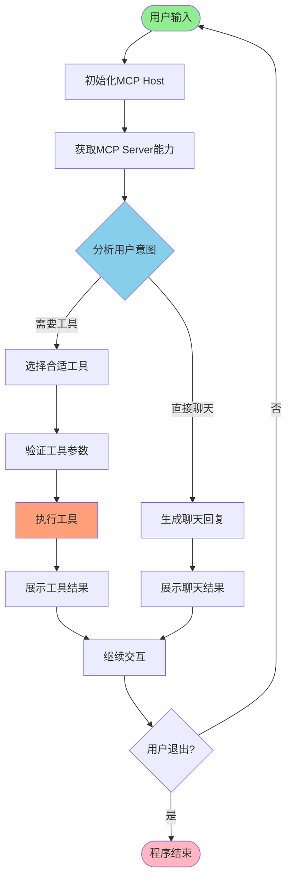
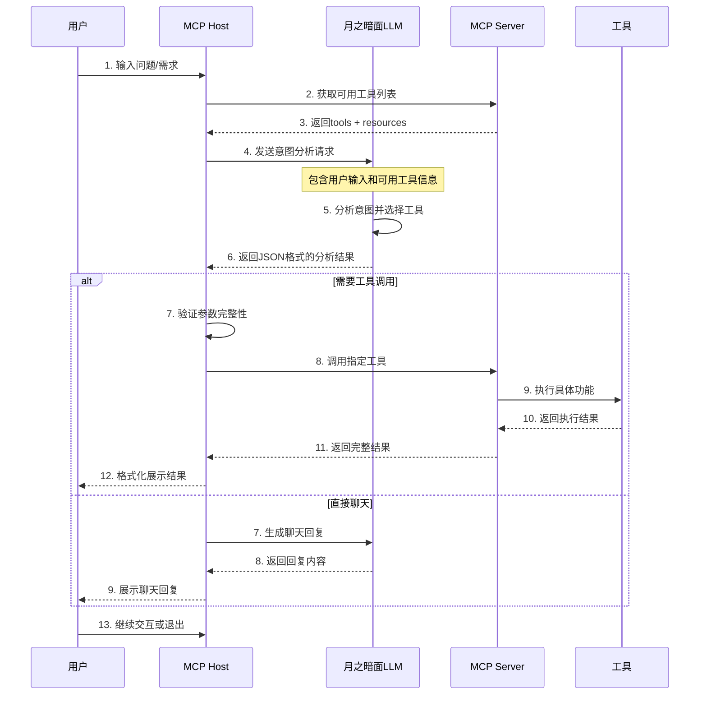

# 通用mcp host的system prompt怎么写

## 概述

网上有一些cursor、claude code等工具的客户端架构分析和源码解读，这些工具由于大而全，会有较复杂的模块化设计、分层管理等，system prompt也包含几万字。
这里尝试实现一个简单的通用mcp host工具，来体验system prompt的设计，暂不涉及客户端架构的设计。

### 用户输入处理流程



### 详细时序图



## 核心工作流程

### 1. 系统启动阶段

*   **配置文件加载**：从`config/config.json`读取配置
*   **日志系统初始化**：配置控制台和文件日志
*   **MCP Server连接**：建立与MCP Server的通信连接
*   **能力分析**：获取并缓存可用工具和资源列表

### 2. 意图分析阶段

#### 2.1 输入预处理

*   清理用户输入文本
*   检测空输入和特殊命令（quit/exit）
*   构建完整的上下文环境

#### 2.2 工具选择逻辑

*   **置信度评估**：基于用户输入和工具描述计算匹配度
*   **参数自动生成**：LLM根据工具schema生成完整参数
*   **错误处理**：处理参数缺失和格式错误

### 3. 执行阶段

#### 3.1 参数验证

*   检查必需参数是否完整
*   验证参数类型和格式
*   提供详细的错误信息

#### 3.2 工具调用

*   通过MCP协议调用指定工具
*   处理执行过程中的异常
*   收集完整的执行结果

#### 3.3 结果展示

*   统一的工具结果展示格式
*   详细的参数和错误信息显示
*   支持长内容的截断展示

## Prompt系统设计

### 系统Prompt模板

#### 1. 通用聊天Prompt

    你是一个智能助手，可以回答各种问题，提供建议，帮助用户解决各种问题。

    当用户询问关于工具、功能或其他问题时，请直接回答。

    保持回答简洁、有用、友好。

#### 2. 工具分析Prompt（核心）

你是一个严格的JSON格式分析器，必须返回有效的JSON格式，不允许返回任何其他格式的文本。

当前可用的工具详情：
{tools\_json}

当前可用的资源详情：
{resources\_json}

**任务**：分析用户输入，返回一个严格的JSON对象，格式如下：

```json
{
    "requires_tool": true,
    "selected_tool": "具体的工具名称",
    "confidence": 0.9,
    "reasoning": "选择这个工具的原因",
    "direct_response": "",
    "tool_parameters": {"参数名": "参数值"},
    "tool_description": "工具功能描述"
}
```

或者当不需要工具时：

```json
{
    "requires_tool": false,
    "selected_tool": "none",
    "confidence": 0.0,
    "reasoning": "为什么不需要工具",
    "direct_response": "直接回复用户的聊天内容",
    "tool_parameters": {},
    "tool_description": ""
}
```

**工具参数验证规则**：

1.  必须检查所选工具的input\_schema，确保所有必需参数都已提供
2.  参数类型必须符合schema要求：string, number, boolean, array, object
3.  必填参数不能遗漏，可选参数可以省略
4.  字符串参数注意转义特殊字符：\n, \t, " 等
5.  数字参数必须是有效数值，布尔值必须是true/false

**工具选择策略**：

1.  优先选择最具体的工具（如render\_mermaid\_chart > generic\_chart\_tool）
2.  当用户意图不清晰时，设置confidence < 0.7
3.  当多个工具都适用时，选择参数要求最简单的工具
4.  如果用户需要多个操作，选择最主要的工具，其他操作在reasoning中说明

**错误处理策略**：

1.  如果用户输入不清晰或参数不完整：
    *   设置confidence < 0.7
    *   在reasoning中说明需要澄清的信息
    *   在direct\_response中询问用户补充信息
2.  如果无法确定合适的工具，宁可返回requires\_tool=false

**格式要求**：

1.  必须返回有效的JSON对象
2.  requires\_tool必须是布尔值true/false
3.  selected\_tool必须是字符串，且必须是可用工具列表中的工具名称，或者"none"
4.  confidence必须是0.0到1.0之间的浮点数
5.  不要返回任何解释性文字，只返回JSON
6.  确保JSON格式正确转义所有特殊字符

**可用工具列表**：{tool\_names}

请严格按照上述格式返回，不要添加任何额外文字。

### System Prompt 设计优点分析

#### 结构化决策框架

*   **二元决策模式**：通过`requires_tool`明确区分聊天模式vs工具调用模式
*   **置信度机制**：`confidence`字段量化模型确定性，支持阈值过滤
*   **决策透明化**：`reasoning`字段让AI决策过程可追溯

#### 零歧义设计

*   **严格格式要求**：强制JSON输出避免自然语言歧义
*   **精确工具匹配**：动态注入可用工具列表，防止幻觉工具
*   **类型安全**：明确参数类型要求，减少运行时错误

#### 鲁棒性保障

*   **多层验证**：从参数验证→工具选择→错误处理的全链路防护
*   **智能降级**：无法确定工具时自动降级到聊天模式
*   **用户澄清机制**：模糊意图时主动询问而非错误执行

#### 扩展性设计

*   **工具无关**：支持任意MCP工具，无需修改prompt结构
*   **动态适应**：通过变量注入实现工具列表的实时更新
*   **策略可配置**：工具选择策略可通过调整prompt内容灵活修改

#### 工程化友好

*   **标准接口**：统一的JSON格式便于程序化解析
*   **调试支持**：reasoning和confidence字段便于问题定位
*   **版本兼容**：JSON Schema设计支持向后兼容演进

#### 用户体验优化

*   **渐进式交互**：confidence阈值实现"不确定就问"的友好体验
*   **错误预防**：参数验证规则在用户侧就阻止错误提交
*   **操作简化**：自动选择最简单工具降低用户认知负担

这种设计实现了**确定性执行**与**智能适应**的完美平衡，既保证了工具调用的可靠性，又保持了系统对复杂场景的处理能力。

> 参考文档：
> Claude Code 原理解读：<https://zhuanlan.zhihu.com/p/1922348743950337337>
> 完整代码：<https://github.com/rainj2013/mermaid_mcp>

