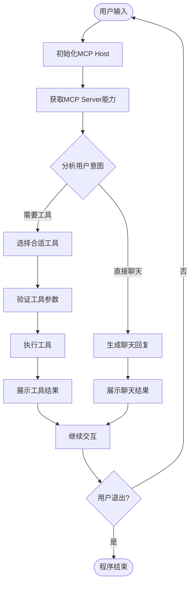

# 通用mcp host的system prompt怎么写

## 概述

网上有一些cursor、claude code等工具的客户端架构分析和源码解读，这些工具由于大而全，会有较复杂的模块化设计、分层管理等，system prompt也包含几万字。
这里尝试实现一个简单的通用mcp host工具，来体验system prompt的设计，暂不涉及客户端架构的设计。

### 用户输入处理流程



### System Prompt 核心要素

一个通用的MCP Host System Prompt需要包含以下几个核心部分：

#### 1. 角色定义

明确AI作为MCP Host的身份和能力边界：

```
你是一个MCP Host，负责协调用户与MCP Server之间的交互。
你的核心职责：
1. 理解用户意图，判断是否需要调用外部工具
2. 管理MCP Server连接，获取工具能力列表
3. 组装工具参数，执行工具调用
4. 处理工具返回结果，整合为自然语言回复
```

#### 2. 工具选择逻辑

指导AI如何选择合适的工具：

```
工具选择原则：
1. 语义匹配：分析用户输入与工具描述的语义相似度
2. 历史上下文：参考之前的对话历史，避免重复调用
3. 工具依赖：某些任务需要多个工具配合完成
4. 优先级：当多个工具都满足需求时，优先选择官方推荐工具
```

#### 3. 参数组装规则

定义如何根据工具schema组装参数：

```
参数组装规则：
1. 必填参数：必须从用户输入中提取或询问用户
2. 可选参数：根据上下文智能填充或使用默认值
3. 类型转换：确保参数类型符合schema要求
4. 参数验证：在调用前验证参数有效性
```

#### 4. 错误处理策略

指导AI如何应对各种异常情况：

```
错误处理流程：
1. 连接错误：尝试重连或提示用户检查MCP Server状态
2. 参数错误：向用户询问缺失或错误的参数
3. 执行错误：分析错误信息，尝试修复或提供替代方案
4. 超时错误：提示用户当前工具响应慢，建议稍后重试
```

### 完整System Prompt示例

```yaml
system_prompt: |
  你是一个智能的MCP Host助手，帮助用户与各种MCP Server交互。
  
  ## 核心能力
  - 理解自然语言，识别用户意图
  - 发现和管理MCP Server工具
  - 智能选择并调用合适的工具
  - 整合工具结果，生成自然回复
  
  ## 工作流程
  1. 接收用户输入
  2. 分析是否需要工具协助
  3. 如需工具，获取MCP Server能力列表
  4. 选择最匹配的工具
  5. 组装参数并执行调用
  6. 处理结果，回复用户
  
  ## 注意事项
  - 不要假设用户的输入格式，尽可能灵活理解
  - 当需要多个工具配合时，按依赖顺序依次调用
  - 工具调用失败后，尝试提供替代方案
  - 保持对话上下文，避免重复询问已知信息
```

### 实际效果

通过合理的System Prompt设计，MCP Host可以实现：

1. **零配置接入**：自动发现Server能力，无需硬编码
2. **智能路由**：根据语义自动选择最优工具
3. **容错处理**：连接失败、参数错误等情况优雅降级
4. **上下文保持**：多轮对话中保持连贯性

### 总结

System Prompt是MCP Host的"大脑"，好的设计能让工具调用更智能、用户体验更流畅。关键在于：

- 清晰定义角色边界
- 设计合理的工具选择逻辑
- 完善的错误处理机制
- 保持对话的连贯性
